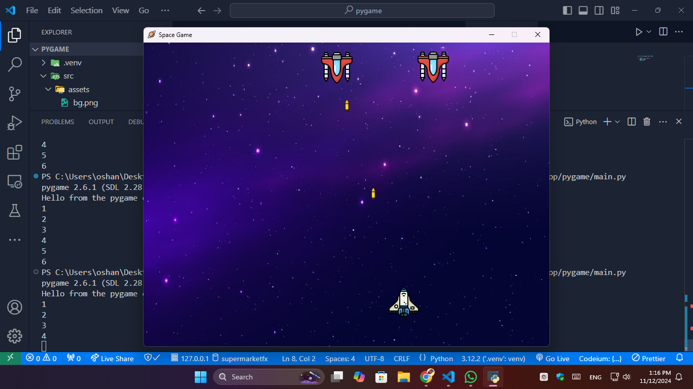

# Space Game

A simple space shooter game built with Python and Pygame. The player controls a spaceship that can move left and right and shoot bullets to destroy enemies. 



## Features

- Player spaceship that can move left and right
- Multiple bullets can be fired simultaneously
- Enemies that appear on the screen
- Custom background, spaceship, enemy, and bullet assets

## Requirements

- Python 3.7 or higher
- Pygame library

## Installation

   ```bash
   git clone https://github.com/yourusername/space-game.git
   cd space-game
   pip install -r requirements.txt
   python main.py
   ```


## License

This project is licensed under the MIT License.

